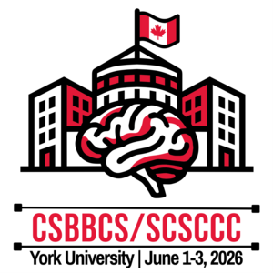

{style="display: block; margin: 0 auto; height:10%" }

The MIND Lab is excited to announce our participation in the upcoming Canadian Society for Brain, Behaviour and Cognitive Science (CSBBS) conference, taking place from June 1-3, 2026, at the Centre for Integrative and Applied Neuroscience, York University, Toronto, Canada. This annual event brings together researchers from across the country to share their latest findings in the fields of brain science, behavior, and cognitive research.

Our lab will be presenting work on attention to accented speech which is led by Dr. Srdan Medimorec in collaboration with Prof. Katherine White at the University of Waterloo.

We look forwards to sharing our findings and engaging with fellow researchers at this exciting event. More details about the conference will be added here later.

The full conference programme can be found here: [https://www.csbbcs.org/meetings/2026-meeting](https://www.csbbcs.org/meetings/2026-meeting)