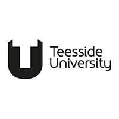
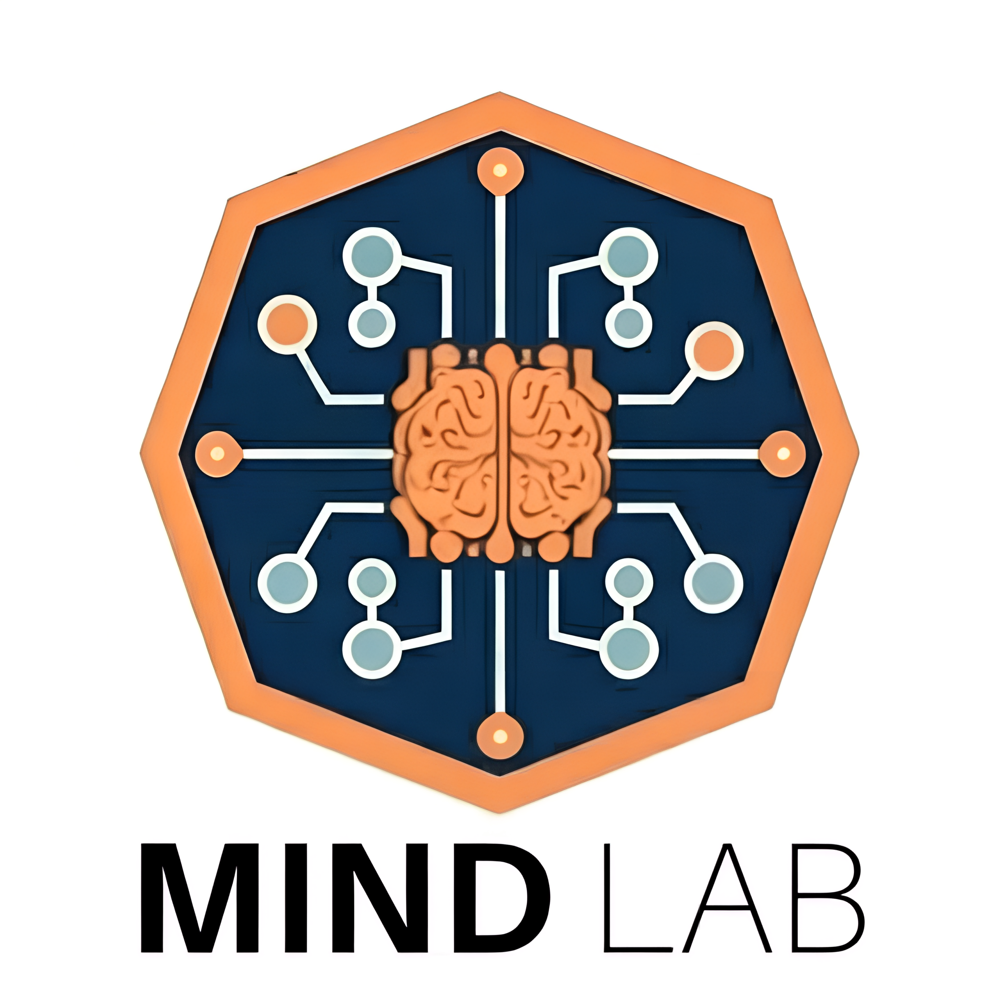
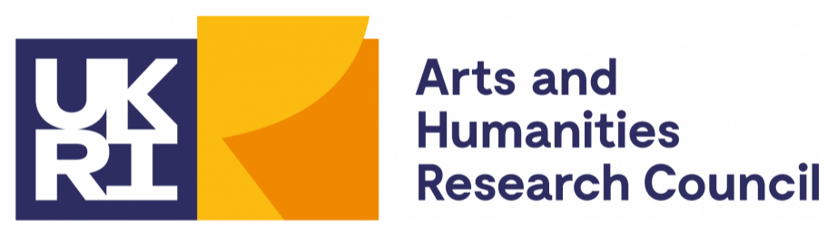
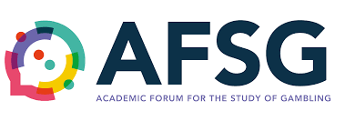
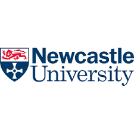

The MIND Lab is hosting a research summit on the 26th June 2026 at the Riverside Stadium in Middlesbrough, which will bring together stakeholders and researchers to discuss recent research we have conducted on the pathways from sports engagement to gambling harms.

The event will discuss our AFSG funded project exploring how social identification with sports groups predicts gambling behaviour and our UKRI/AHRC funded project reviewing evidence on sports engagement as a gateway activity to gambling activity.

Places are free but limited, and the event will include research talks, round table discussions, lived experience speakers, and involvement from a range of services in the region. Lunch and refreshments will be provided.

Booking is via eventbrite, and you can reserve your place by scanning the QR code at the bottom of this page or by following [this link](https://www.eventbrite.co.uk/e/pathways-from-sports-engagement-to-gambling-harms-a-research-summit-tickets-1986061765203).

<div class="embed-wrapper">
<div class="poster-container">

<header>

<h1>`r params$event_title`</h1>

</header>


<div class="info-strip">
<span>📅 `r params$date_time`</span>
<span>📍 `r params$location`</span>
</div>

<div class="main-content">
<div class="overview">
<h3>Event Overview</h3>
<p>
Aimed at stakeholders who work at the intersection of sports and gambling harms. 
This event brings together stakeholders to discuss recently conducted research, help translate findings into practice, and shape the direction of future research.
</p>
<p>
The day will include research talks, round table discussions, lived experience speakers, and involvement from a range of services in the region.
</p>
</div>

<div class="speakers">
<h3>Key Speakers</h3>

```{r}
#| echo: false
#| results: 'asis'
cat("<ul>")
for (speaker in params$speakers) {
cat(paste0("<li>", speaker, "</li>"))
}
cat("</ul>")
```

<div class="info-section">
<h3>Information</h3>
<p>
This event is free to attend but places are limited. Lunch and refreshments will be provided. 
For more information, please contact <a href="mailto:christopher.wilson@tees.ac.uk"> christopher.wilson@tees.ac.uk</a>.
</p>
</div>
</div>


</div>

<footer>
<div class="qr-row">

<div>
<strong>Register Now</strong><br>
Scan to reserve your spot via Eventbrite
</div>
</div>

<div class="funder-logos">





</div>
</footer>
</div>
</div>