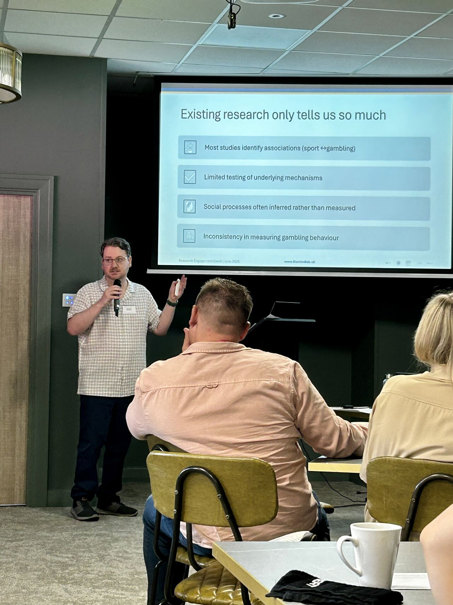
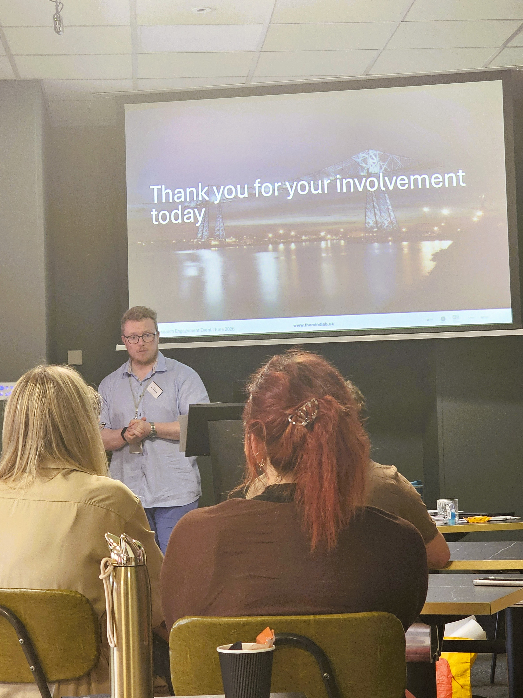
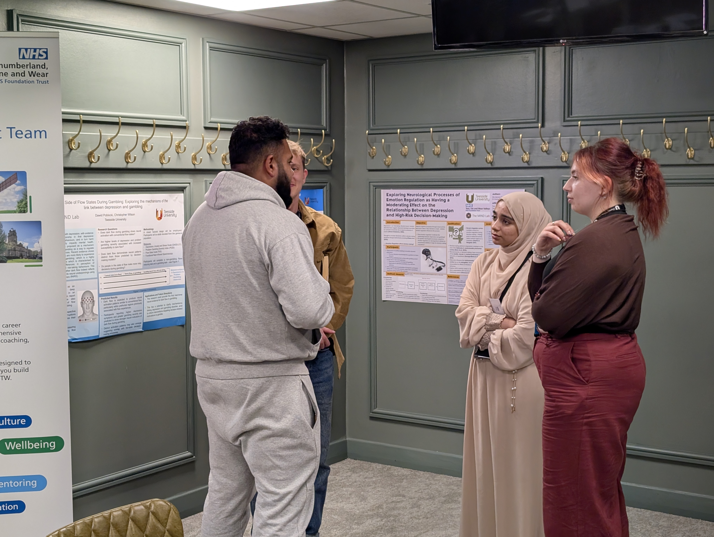
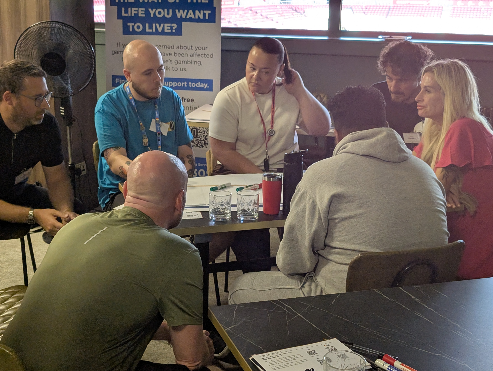
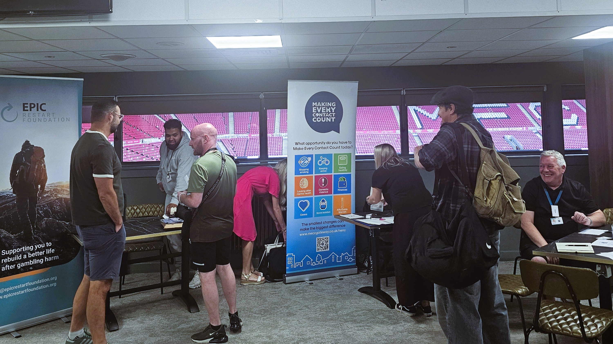
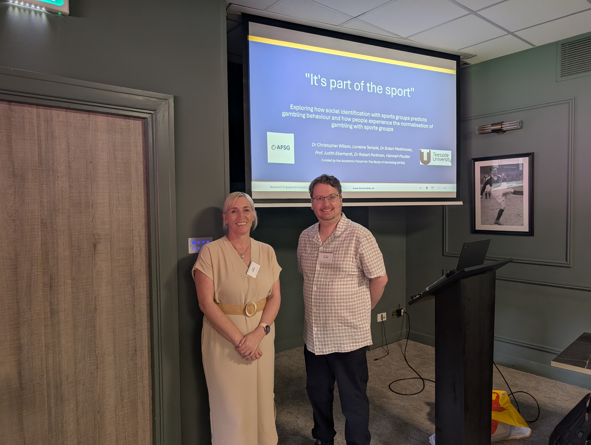

On Friday June 26th 2026, we brought together 40 practitioners, clinicians, lived experience experts and researchers to share their insights and experiences on the links between sports engagement and gambling harms. The event took place at the Riverside Stadium in Middlesbrough and was hosted by out research lab. We were joined by a range of stakeholders from across the UK, including representatives from Gambling Harms UK, NHS, NECA, MECC and ADPH North East Gambling Harms programme.

```{=html}

<style>
.custom-gallery {
  display: grid;
  grid-template-columns: repeat(auto-fill, minmax(200px, 1fr));
  gap: 12px;
}
.custom-gallery img {
  width: 100%;
  height: 200px; /* Forces uniform thumbnail height */
  object-fit: cover; /* Crops image cleanly without distorting aspect ratio */
  border-radius: 4px;
  transition: transform 0.2s ease;
}
.custom-gallery img:hover {
  transform: scale(1.02);
}
</style>


```


::: {.custom-gallery}

{group="event_2026"}

{group="event_2026"}

{group="event_2026"}

{group="event_2026"}

{group="event_2026"}

{group="event_2026"}

{group="event_2026"}

{group="event_2026"}

{group="event_2026"}

{group="event_2026"}

::: 

The event was opened by Dr. Christopher Wilson and Dr Andrew Richardson who presented their UKRI funded rapid evidence review on the compound vulnerabilities that indicate risk of gambling harms. The review highlighted the complex interplay between sports participation, sports betting, and gambling-related harms, and identified key areas for future research.

The second research talk by Dr. Wilson, focused on the AFSG funded project which examined the role of social identification in the link between sports and gambling harms. The research identified differential patterns of gambling behaviour were associated with different types of social connection to sports, and highlighted the importance of considering social identity in the development of interventions to reduce gambling harms.

The keynote address was delivered by Ben Jones from Gambling Harms UK, who shared his lived experience of gambling harms and discussed the need for a policy driven approach to addressing exploitative commercial practices and an evidence driven approach to supporting those at risk of gambling harms.

In addition to the talks, we had several feedback and discussion sessions, which highlighted the importance of collaboration between researchers, practitioners, and policymakers to develop effective strategies to prevent and mitigate gambling harms.

There are further outputs from the projects and the event to follow and we will be sharing these in the coming months. We would like to thank all of our attendees for their contributions and insights, and we look forward to continuing the conversation on this important topic.
