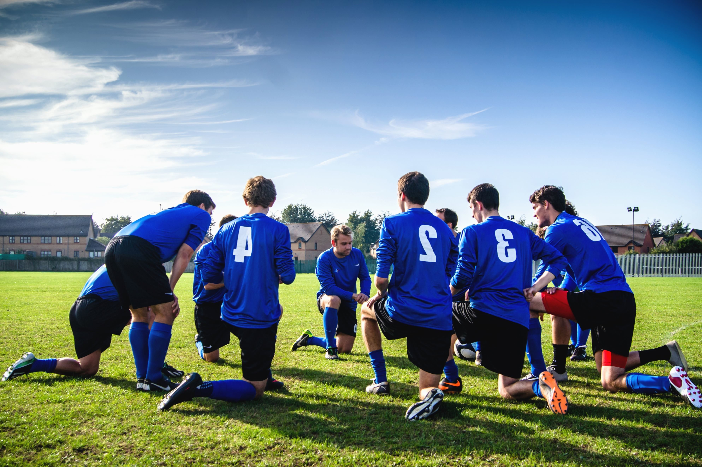

{style="display: block; margin: 0 auto; width:50%" }

## Project title: "It's part of the sport: How social identification with sports groups predicts gambling behaviour"

### What was the aim of this project?

This project set out to understand how being involved in sport—whether as a player, fan, or regular viewer—relates to gambling behaviour.
In particular, the research explored how strongly identifying with sports groups (such as friends, teams, or wider fan communities) shapes attitudes towards gambling and influences behaviour. It also aimed to understand how gambling becomes part of everyday social life within sports settings, and to use these insights to inform practical recommendations for organisations working in public health, sport, and policy.

### What questions did the research address?
The project focused on three key questions. First, which aspects of gambling behaviour are linked to identifying with sports groups? Second, whether this sense of identity changes how sport engagement and gambling are connected. Third, how people experience gambling becoming a normal part of social life around sport.

### How was the research carried out?

The project combined a large-scale survey with in-depth interviews. A survey of adults in the UK who regularly engage with sport examined gambling behaviour, attitudes, exposure to advertising, and levels of connection to sports groups. Participants were recruited through sports clubs, fan networks, online platforms and related communities to ensure the study reflected real-world sports engagement.

This was followed by a series of interviews with 11 participants, which explored personal experiences of gambling in sports settings. These conversations focused on how gambling fits into social routines, relationships, and shared experiences.

Importantly, people with lived experience of gambling harms were involved throughout the project. They helped shape the design, language, and interpretation of the research to ensure it remained grounded and relevant.

## Current project status (June 2026) and what happens next:

We have completed data collection and initial analysis across both the survey and interview components of the project. We are now in the process of finalising our findings and preparing them for publication. We are also working on translating our findings into practical recommendations for organisations working in public health, sport, and policy. We will be sharing these findings at our [stakeholder event in June 2026](https://themindlab.uk/events/gambling_summit.html) and through academic publications and stakeholder channels in the coming months.

<hline></hline>

# Initial project announcement (May 2025)
 
The MIND Lab has been awarded a grant by the Academic Forum for the Study of Gambling (AFSG) to explore links between sports engagement and gambling behaviour. 
 

Highlighting the links between sport and gambling in the UK, Dr. Christopher Wilson discussed his project with the [AFSG](https://afsg.org/2025/04/30/exploratory-grant-award-winners-2025/):

>"The increasing prominence of gambling in professional sports broadcasting and sponsorship creates an association between them, to the extent that gambling is starting to become a normalised part of socialising around some sports. It’s important that we understand which features of gambling behaviour are predicted by this relationship, and how sports groups experience the exposure to gambling, so we can provide evidence to support targeted harm-reduction approaches.”
    
The project is led by Dr. Christopher Wilson and Co-investigators Dr. Srdan Medimorec, Dr. Robert Portman, Dr. Judith Eberhardt. Hannah Poulter (Bristol) is also collaborating on this project. Project updates will be shared on the MIND Lab website and media channels, so please follow us to keep up to date with our research.

{style="display: block; margin: 0 auto; width:50%" }
  
Details are available on the [AFSG website](https://afsg.org/2025/04/30/exploratory-grant-award-winners-2025/).

