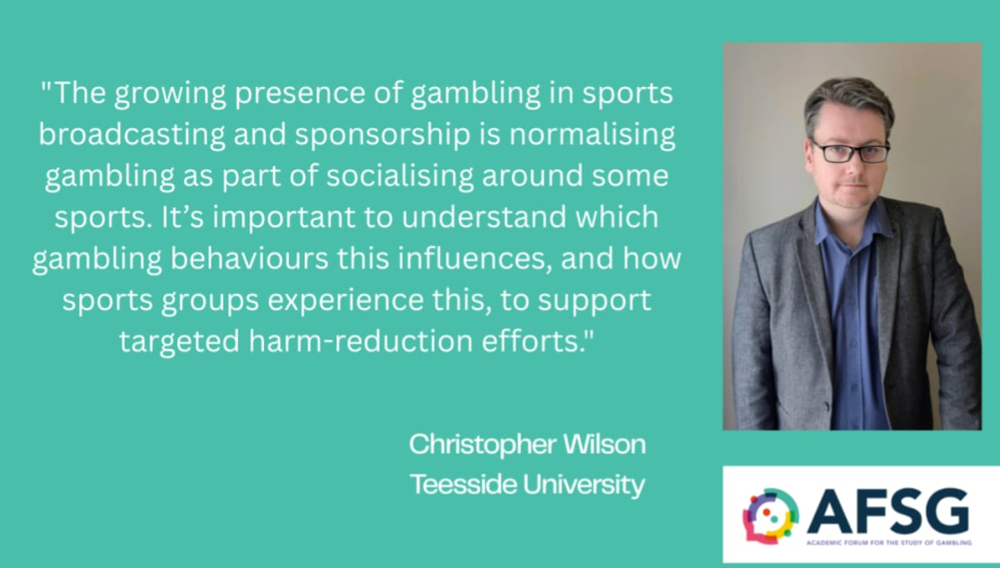

This project was funded by the Academic Forum for the Study of Gambling (AFSG), as part of their 2024-2025 funding round. It was led by Dr Christopher Wilson, with Co-investigators Dr Srdan Medimorec, Prof Judith Eberhardt, Dr Robert Portman and Hannah Poulter. The project was supported by a team of people with lived experience of gambling harms, who were involved in shaping the design, language and interpretation of the research.

{style="display: block; margin: 0 auto; width:50%" }

### What was the aim of this project?

This project set out to understand how being involved in sport—whether as a player, fan, or regular viewer—relates to gambling behaviour. In particular, the research explored how strongly identifying with sports groups (such as friends, teams, or wider fan communities) shapes attitudes towards gambling and influences behaviour. It also aimed to understand how gambling becomes part of everyday social life within sports settings, and to use these insights to inform practical recommendations for organisations working in public health, sport, and policy.

### What questions did the research address?
The project focused on three key questions. First, which aspects of gambling behaviour are linked to identifying with sports groups? Second, whether this sense of identity changes how sport engagement and gambling are connected. Third, how people experience gambling becoming a normal part of social life around sport.

### How was the research carried out?

The project combined a large-scale survey with in-depth interviews. A survey of adults in the UK who regularly engage with sport examined gambling behaviour, attitudes, exposure to advertising, and levels of connection to sports groups. Participants were recruited through sports clubs, fan networks, online platforms and related communities to ensure the study reflected real-world sports engagement.

This was followed by a series of interviews with 11 participants, which explored personal experiences of gambling in sports settings. These conversations focused on how gambling fits into social routines, relationships, and shared experiences.

Importantly, people with lived experience of gambling harms were involved throughout the project. They helped shape the design, language, and interpretation of the research to ensure it remained grounded and relevant.

## Current project status (June 2026) and what happens next:

We have completed data collection and initial analysis across both the survey and interview components of the project. We are now in the process of finalising our findings and preparing them for publication. We are also working on translating our findings into practical recommendations for organisations working in public health, sport, and policy. We will be sharing these findings at our [stakeholder event in June 2026](https://themindlab.uk/events/gambling_summit.html) and through academic publications and stakeholder channels in the coming months.

A summary of the key findings from the project will be added here once they are finalised and links to the publications will be added once they are available.

# Events related to this project:

::: {#talks}
:::

# People involved in this project: